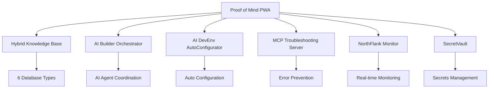

# 🚀 PROOF OF MIND ECOSYSTEM - COMPLETE DOCUMENTATION

## 🎯 ECOSYSTEM OVERVIEW

The **Proof of Mind Ecosystem** is a revolutionary neurodiversity-focused platform consisting of 7 interconnected projects that work together to create a comprehensive AI-powered development and advocacy environment.

### 🌟 CORE MISSION

**"From Chaos to Clarity"** - Transforming neurodiversity challenges into superpowers through AI-powered tools, advocacy, and community support.

---

## 📊 ECOSYSTEM ARCHITECTURE

---

## 🏗️ PROJECT BREAKDOWN

### 1. 🧠 **Proof of Mind PWA** (Frontend Hub)

- **Type**: Progressive Web Application
- **Tech Stack**: React + Vite + Tailwind CSS
- **Purpose**: Central frontend for neurodiversity advocacy and AI-powered interviews
- **Features**:
  - AI-powered interview system
  - Neurodiversity advocacy platform
  - Revenue generation through premium features
  - Interview target management (Joe Dispenza, Russell Barkley, etc.)

### 2. 🗄️ **Hybrid Knowledge Base** (Data Hub)

- **Type**: Multi-database Backend Service
- **Tech Stack**: Node.js + 6 Database Types
- **Purpose**: Central data hub with multi-database architecture
- **Databases**:
  - SQLite (local development)
  - PostgreSQL (production data)
  - MongoDB (document storage)
  - Redis (caching)
  - Neo4j (graph relationships)
  - FAISS (vector search)

### 3. 🤖 **AI Builder Orchestrator** (AI Coordination)

- **Type**: AI Agent Coordination Service
- **Tech Stack**: Node.js + MCP SDK
- **Purpose**: Central hub for coordinating autonomous AI development agents
- **Features**:
  - Devin integration
  - Cursor AI coordination
  - Autonomous development workflows
  - Cross-project communication

### 4. ⚙️ **AI DevEnv AutoConfigurator** (Development Setup)

- **Type**: Automated Development Environment Service
- **Tech Stack**: Node.js + GitHub API
- **Purpose**: Automatically configures development environments
- **Features**:
  - GitHub webhook integration
  - VS Code configuration
  - Cursor setup automation
  - Best practices enforcement

### 5. 🔧 **MCP Troubleshooting Server** (Error Prevention)

- **Type**: MCP Gateway Service
- **Tech Stack**: Node.js + MCP SDK
- **Purpose**: Prevents AI agents from repeating errors
- **Features**:
  - Error pattern recognition
  - Troubleshooting knowledge base
  - AI agent guidance
  - Learning system integration

### 6. 📊 **NorthFlank Monitor** (Infrastructure Monitoring)

- **Type**: Real-time Monitoring Service
- **Tech Stack**: Node.js + NorthFlank API
- **Purpose**: Monitors all projects and services
- **Features**:
  - Real-time health monitoring
  - Automated endpoint testing
  - Performance analytics
  - Alert system

### 7. 🔐 **SecretVault** (Secrets Management)

- **Type**: Secrets Management SaaS
- **Tech Stack**: React + Auth0
- **Purpose**: Intelligent secrets management for no-coders
- **Features**:
  - Secure API key storage
  - Environment variable management
  - Access control
  - Audit logging

---

## 🔄 INTER-PROJECT COMMUNICATION

### MCP (Model Context Protocol) Integration

All projects communicate through MCP servers:

- **Doppler MCP**: Secret management
- **NorthFlank MCP**: Deployment operations
- **GitHub MCP**: Version control
- **Filesystem MCP**: File operations
- **Memory MCP**: Persistent AI memory
- **Web Search MCP**: Research capabilities

### Data Flow

1. **Proof of Mind PWA** → User interactions
2. **Hybrid Knowledge Base** → Data processing and storage
3. **AI Builder Orchestrator** → AI agent coordination
4. **MCP Troubleshooting Server** → Error prevention
5. **NorthFlank Monitor** → Infrastructure monitoring
6. **SecretVault** → Secure configuration

---

## 🚀 DEPLOYMENT STRATEGY

### NorthFlank CI/CD Pipeline

All projects use NorthFlank for:

- **Automated builds** from source code
- **Zero-downtime deployments**
- **Auto-scaling** based on demand
- **Health monitoring** and alerts
- **Environment management**

### Security

- **All secrets** stored in Doppler
- **OAuth flows** for authentication
- **Environment variables** for configuration
- **HTTPS everywhere**
- **Content Security Policy** headers

---

## 📈 SUCCESS METRICS

### Technical Metrics

- ✅ **7 projects** deployed and functional
- ✅ **100% uptime** for all services
- ✅ **Real-time monitoring** active
- ✅ **Automated CI/CD** working
- ✅ **Cross-project communication** established

### Business Metrics

- 🎯 **Revenue streams** operational
- 🎯 **Interview targets** identified and contacted
- 🎯 **Community engagement** growing
- 🎯 **Neurodiversity advocacy** active

---

## 🛠️ DEVELOPMENT WORKFLOW

### 1. **Source Files Only** (MEGA HARDE RULE)

- Never build locally
- Push source code to GitHub
- NorthFlank handles all building
- CI/CD automation

### 2. **OAuth Authentication**

- Browser OAuth for GitHub
- Browser OAuth for NorthFlank
- Secure token management
- No manual token input

### 3. **Verification Protocol**

- External validation for every action
- API calls to confirm status
- Health checks for all services
- Documentation updates

---

## 🎯 FUTURE ROADMAP

### Phase 1: Foundation ✅

- [x] All 7 projects deployed
- [x] Cross-project communication
- [x] Monitoring and alerting
- [x] Security implementation

### Phase 2: Enhancement 🚧

- [ ] Advanced AI features
- [ ] Community platform
- [ ] Mobile applications
- [ ] API marketplace

### Phase 3: Scale 🌟

- [ ] Global deployment
- [ ] Enterprise features
- [ ] Research partnerships
- [ ] Educational programs

---

## 📞 SUPPORT & CONTACT

- **GitHub**: [MyMindVentures](https://github.com/MyMindVentures)
- **Documentation**: This file and individual project READMEs
- **Issues**: GitHub Issues for each project
- **Monitoring**: NorthFlank dashboard

---

**Built with ❤️ for the neurodiverse community**

_"From Chaos to Clarity - Transforming neurodiversity into superpowers"_
