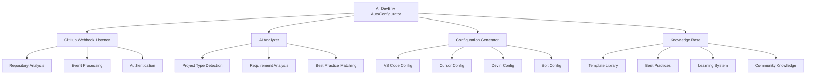

# ⚙️ AI DevEnv AutoConfigurator

> **AI-powered automated development environment configuration service for VS Code, Cursor, Devin, and Bolt**

[](https://github.com/MyMindVentures/AI-DevEnv-AutoConfigurator)
[](https://app.northflank.com)
[](https://github.com/MyMindVentures/AI-DevEnv-AutoConfigurator)

## 🎯 Overview

The **AI DevEnv AutoConfigurator** is the intelligent automation engine of the Proof of Mind Ecosystem, automatically configuring development environments for VS Code, Cursor, Devin, and Bolt when new repositories are created. It ensures consistent, best-practice configurations across all projects while learning from each configuration to improve future setups.

## ✨ Key Features

### 🤖 **AI-Powered Configuration**

- **Intelligent Analysis**: AI analyzes repository structure and requirements
- **Best Practice Application**: Automatically applies industry best practices
- **Learning System**: Learns from each configuration to improve future setups
- **Context Awareness**: Understands project context and requirements

### 🔄 **Multi-Platform Support**

- **VS Code**: Complete VS Code workspace configuration
- **Cursor**: Cursor AI editor configuration
- **Devin**: Devin AI agent configuration
- **Bolt**: Bolt AI platform configuration
- **Custom Tools**: Support for custom development tools

### 🎯 **Automated Workflow**

- **GitHub Webhook Integration**: Automatic trigger on repository creation
- **OAuth Authentication**: Secure authentication with GitHub
- **Configuration Generation**: AI-generated configuration files
- **Validation & Testing**: Automatic validation of configurations

### 📚 **Knowledge Base Integration**

- **Configuration Templates**: Pre-built templates for common project types
- **Best Practices Database**: Curated collection of development best practices
- **Learning Repository**: Continuous learning from successful configurations
- **Community Contributions**: Community-driven configuration improvements

## 🏗️ Architecture



## 🚀 Quick Start

### Prerequisites

- Node.js 18+
- GitHub repository access
- AI service API keys (OpenAI, Anthropic)

### Installation

```bash
# Clone the repository
git clone https://github.com/MyMindVentures/AI-DevEnv-AutoConfigurator.git
cd AI-DevEnv-AutoConfigurator

# Install dependencies
npm install

# Start development server
npm run dev
```

### Production Deployment

```bash
# Deploy to NorthFlank (automatic CI/CD)
git push origin main
# NorthFlank will automatically build and deploy
```

## 📋 API Endpoints

### Webhook Management

- `POST /webhook` - GitHub webhook endpoint
- `GET /webhook/status` - Webhook status and health
- `POST /webhook/test` - Test webhook functionality
- `GET /webhook/logs` - Webhook processing logs

### Configuration Management

- `POST /api/configure` - Trigger manual configuration
- `GET /api/configurations` - List all configurations
- `GET /api/configurations/:id` - Get configuration details
- `PUT /api/configurations/:id` - Update configuration
- `DELETE /api/configurations/:id` - Delete configuration

### AI Services

- `POST /api/analyze` - Analyze repository for configuration
- `GET /api/analysis/:id` - Get analysis results
- `POST /api/generate` - Generate configuration files
- `GET /api/templates` - List available templates

### Knowledge Base

- `GET /api/knowledge` - Get knowledge base content
- `POST /api/knowledge` - Add new knowledge
- `PUT /api/knowledge/:id` - Update knowledge
- `DELETE /api/knowledge/:id` - Delete knowledge

## 🔧 Configuration

### Environment Variables

```env
# Core Configuration
NODE_ENV=production
PORT=3006
LOG_LEVEL=info

# GitHub Integration
GITHUB_WEBHOOK_SECRET=your_webhook_secret
GITHUB_APP_ID=your_app_id
GITHUB_PRIVATE_KEY=your_private_key
GITHUB_CLIENT_ID=your_client_id
GITHUB_CLIENT_SECRET=your_client_secret

# AI Services
OPENAI_API_KEY=your_openai_key
ANTHROPIC_API_KEY=your_anthropic_key

# Database
DATABASE_URL=sqlite://./data/autoconfigurator.db

# Notification
SLACK_WEBHOOK_URL=your_slack_webhook
EMAIL_SMTP_HOST=smtp.gmail.com
EMAIL_SMTP_PORT=587
EMAIL_USER=your_email
EMAIL_PASS=your_password
```

### GitHub App Configuration

```javascript
// GitHub App configuration
const githubConfig = {
  appId: process.env.GITHUB_APP_ID,
  privateKey: process.env.GITHUB_PRIVATE_KEY,
  webhookSecret: process.env.GITHUB_WEBHOOK_SECRET,
  clientId: process.env.GITHUB_CLIENT_ID,
  clientSecret: process.env.GITHUB_CLIENT_SECRET,
};
```

## 🤖 AI Configuration Process

### 1. **Repository Analysis**

```
Repository Created → Webhook Triggered → Repository Analysis → Project Type Detection
```

### 2. **Configuration Generation**

```
Analysis Results → AI Processing → Configuration Generation → Validation
```

### 3. **Deployment**

```
Validated Config → File Generation → Repository Update → Notification
```

### 4. **Learning**

```
Configuration Success → Learning Update → Knowledge Base Update → Template Improvement
```

## 🛠️ Development

### Project Structure

```
src/
├── aiAnalyzer.js     # AI analysis logic
├── auth.js          # Authentication handling
├── configTemplates/ # Configuration templates
├── github.js        # GitHub API integration
├── index.js         # Application entry point
├── notifier.js      # Notification system
└── toolApis/        # Tool API integrations
```

### Adding New Tool Support

1. Create tool API integration in `src/toolApis/`
2. Add configuration template in `src/configTemplates/`
3. Implement AI analysis logic
4. Test integration
5. Deploy to production

### Configuration Template Schema

```javascript
// Example configuration template
const configTemplate = {
  id: 'react-vite-tailwind',
  name: 'React + Vite + Tailwind CSS',
  description: 'Modern React application with Vite and Tailwind CSS',
  files: [
    {
      path: '.vscode/settings.json',
      content: {
        'editor.formatOnSave': true,
        'editor.defaultFormatter': 'esbenp.prettier-vscode',
      },
    },
    {
      path: '.cursorrules',
      content: 'AI rules for React development...',
    },
  ],
  dependencies: ['react', 'vite', 'tailwindcss'],
  scripts: {
    dev: 'vite',
    build: 'vite build',
    preview: 'vite preview',
  },
};
```

## 📊 Analytics & Monitoring

### Key Metrics

- **Configuration Success Rate**: Percentage of successful configurations
- **AI Accuracy**: Accuracy of AI analysis and recommendations
- **Processing Time**: Time to complete configuration
- **User Satisfaction**: Feedback on generated configurations

### Real-time Monitoring

- **Webhook Processing**: Real-time webhook processing status
- **AI Service Health**: AI service availability and performance
- **Configuration Queue**: Pending configuration requests
- **Error Tracking**: Configuration errors and failures

## 🔒 Security

### Data Protection

- **Encrypted Storage**: All configuration data encrypted
- **Access Control**: Role-based permissions
- **Audit Logging**: Track all configuration activities
- **Secure Communication**: HTTPS for all communications

### GitHub Integration Security

- **Webhook Validation**: Secure webhook signature validation
- **OAuth Security**: Secure OAuth flow implementation
- **Token Management**: Secure token storage and rotation
- **Permission Scoping**: Minimal required permissions

## 📈 Performance

### Optimization Features

- **Async Processing**: Asynchronous configuration processing
- **Caching**: Cache frequently accessed templates
- **Batch Processing**: Batch multiple configurations
- **Resource Optimization**: Efficient resource usage

### Benchmarks

- **Processing Time**: < 30 seconds for configuration
- **Throughput**: 100+ configurations per hour
- **Uptime**: 99.9% availability target
- **Accuracy**: 95%+ configuration success rate

## 🧪 Testing

### Test Strategy

```bash
# Unit tests
npm test

# Integration tests
npm run test:integration

# AI tests
npm run test:ai

# Webhook tests
npm run test:webhook
```

### Test Coverage

- **Unit Tests**: 90%+ coverage
- **Integration Tests**: GitHub API and AI service testing
- **AI Tests**: AI analysis and generation testing
- **Webhook Tests**: Webhook processing testing

## 📚 Documentation

### Additional Resources

- [Configuration Guide](./docs/configuration.md)
- [API Reference](./docs/api.md)
- [AI Integration](./docs/ai.md)
- [GitHub Integration](./docs/github.md)

### Support

- **GitHub Issues**: Bug reports and feature requests
- **Discussions**: Community discussions
- **Wiki**: Additional documentation
- **Email**: support@mymindventures.com

## 📄 License

This project is licensed under the MIT License - see the [LICENSE](LICENSE) file for details.

## 🙏 Acknowledgments

- **GitHub**: For excellent API and webhook support
- **OpenAI**: For GPT-4 integration
- **Anthropic**: For Claude integration
- **Development Community**: For best practices and templates
- **Neurodiverse Community**: For inspiration and feedback

---

**Built with ❤️ for the development community**

_"Intelligent automation for consistent, best-practice development environments"_
